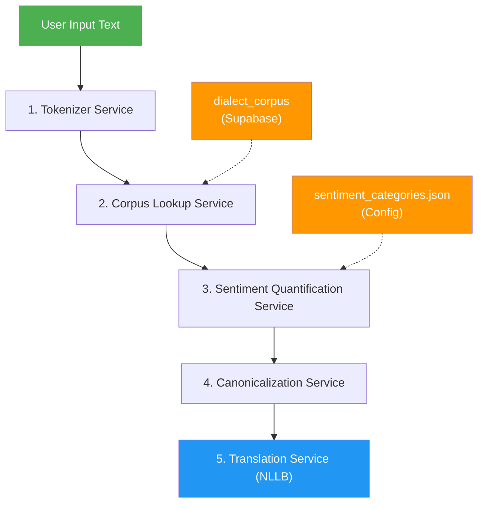

# Text Pre-Processing Pipeline for Translation Service

Build a multi-stage pre-processing pipeline that intercepts user input text **before** it reaches the NLLB translation service. The pipeline will tokenize, analyze sentiment, calculate weighted sentiment scores, and canonicalize slang/colloquial/dialect terms into standardized equivalents using the `dialect_corpus` table.

## User Review Required

> [!IMPORTANT]
> **Supabase `dialect_corpus` Table Schema Changes Required**
> The current `dialect_corpus` table (based on the seed file) has columns: `source_text`, `dialect_translation`, `region`, `context_tag`, `status`. This plan requires **adding new columns** to support the sentiment-driven pre-processing pipeline:
> - `sentiment_score` (float) — The sentimental weight tag for contextual disambiguation (e.g., `1.0` = Flirty, `6.0` = Gambling)
> - `weight` (float, default `1.0`) — Prioritization weight for the weighted average formula
> - `standard_term` (text) — The NLLB-friendly standardized replacement term
>
> You will need to add these columns via the Supabase Dashboard or a migration. I'll provide an SQL migration script.

> [!WARNING]
> **Filipino Negation Words**
> The negation logic below handles common Filipino negators: `hindi`, `di`, `huwag`, `wag`, `wala`, `walang`, `dili`, `ayaw`. If you have additional negators specific to your supported dialects (e.g., Cebuano, Batangeño), please let me know so I can include them.

## Open Questions

1. **Source language filtering**: Should the corpus lookup always filter by `source_language` (e.g., only look up Tagalog terms when the user selects Tagalog as source)? Or should it do a broad lookup across all source languages?

2. **Fallback behavior**: If a detected slang term has multiple `dialect_corpus` matches with different sentiment scores but the sentence-level context analysis is inconclusive, should we default to the highest-weight entry, or skip canonicalization for that token?

3. **Multi-word expressions**: Terms like "bad trip", "sana all", "de jk" are multi-word. Should the tokenizer prioritize matching multi-word phrases first before falling back to single-word lookups? (The plan below assumes **yes**.)

4. **Logging/Auditing**: Should pre-processing results (original → canonicalized mapping) be logged for admin review? This could help improve the corpus over time.

---

## Architecture Overview



---

## Proposed Changes

### Supabase Migration

#### [NEW] SQL Migration Script (manual execution in Supabase Dashboard)

A migration to add the required columns to `dialect_corpus`:

```sql
-- Add pre-processing pipeline columns to dialect_corpus
ALTER TABLE dialect_corpus
ADD COLUMN IF NOT EXISTS sentiment_score FLOAT DEFAULT 0.0,
ADD COLUMN IF NOT EXISTS weight FLOAT DEFAULT 1.0,
ADD COLUMN IF NOT EXISTS standard_term TEXT;

-- Index for fast term lookups during tokenization
CREATE INDEX IF NOT EXISTS idx_dialect_corpus_source_text_lower
ON dialect_corpus (LOWER(source_text));

-- Index for sentiment-based disambiguation
CREATE INDEX IF NOT EXISTS idx_dialect_corpus_sentiment
ON dialect_corpus (source_text, sentiment_score);
```

---

### Sentiment Categories Configuration

#### [NEW] [sentiment_categories.json](file:///Users/ralphalcantara/School_Works/Third_Year/DialectGo/backend/app/config/sentiment_categories.json)

A JSON configuration file mapping sentiment score ranges to contextual categories. This drives the contextual disambiguation engine.

```json
{
  "categories": {
    "1.0": { "label": "Flirty / Romantic", "keywords": ["gusto", "crush", "mahal", "siya", "kita", "heart"] },
    "2.0": { "label": "Internet Slang / Colloquial", "keywords": ["lol", "omg", "charot", "eme", "jk"] },
    "3.0": { "label": "Happy / Positive", "keywords": ["masaya", "saya", "galing", "nice", "sarap", "luto", "kain"] },
    "4.0": { "label": "Angry / Negative", "keywords": ["galit", "inis", "trip", "bad", "asar", "leche"] },
    "5.0": { "label": "Regional / Batangeño", "keywords": ["ala eh", "ga", "oy", "ngani"] },
    "6.0": { "label": "Gambling / Betting", "keywords": ["pusta", "manok", "sabong", "taya", "sugal", "pula"] }
  },
  "negators": ["hindi", "di", "huwag", "wag", "wala", "walang", "dili", "ayaw"],
  "intensifiers": ["sobra", "grabe", "napaka", "ubod", "todo", "super", "very", "talaga"],
  "score_thresholds": {
    "very_negative": [-1.0, -0.6],
    "negative": [-0.6, -0.2],
    "neutral": [-0.2, 0.2],
    "positive": [0.2, 0.6],
    "very_positive": [0.6, 1.0]
  }
}
```

---

### Pre-Processing Services

#### [NEW] [preprocessor.service.js](file:///Users/ralphalcantara/School_Works/Third_Year/DialectGo/backend/app/services/preprocessor.service.js)

The **main orchestrator** that wires all sub-services together. Exposes a single `preprocessText(text, sourceLang)` function to be called by the controller before translation.

**Pipeline steps:**
1. Call `TokenizerService.tokenize(text)` → produces tokens array
2. Call `CorpusLookupService.lookupTokens(tokens, sourceLang)` → enriches tokens with corpus matches
3. Call `SentimentService.calculateSentiment(enrichedTokens)` → returns overall weighted score + per-token sentiment analysis
4. Call `CanonicalizationService.canonicalize(text, enrichedTokens, sentimentResult)` → returns the standardized text

---

#### [NEW] [tokenizer.service.js](file:///Users/ralphalcantara/School_Works/Third_Year/DialectGo/backend/app/services/tokenizer.service.js)

**Responsibilities:**
- Split input text into tokens (words + punctuation)
- Preserve original positions/indices for accurate reconstruction
- Support multi-word expression detection (prioritize matching "bad trip" as one token before "bad" + "trip")
- Normalize casing for lookup while preserving original casing for reconstruction

**Key functions:**
- `tokenize(text)` → `Token[]` where each Token = `{ original, normalized, startIndex, endIndex, type: 'word' | 'punctuation' | 'whitespace' }`

---

#### [NEW] [corpusLookup.service.js](file:///Users/ralphalcantara/School_Works/Third_Year/DialectGo/backend/app/services/corpusLookup.service.js)

**Responsibilities:**
- Query `dialect_corpus` table for each token
- Batch-fetch all unique normalized tokens in a single Supabase query for efficiency (avoid N+1)
- Return all possible matches (there may be multiple rows per term with different sentiment scores)
- In-memory caching with TTL to avoid repeated DB hits for common terms

**Key functions:**
- `lookupTokens(tokens, sourceLang)` → `EnrichedToken[]` (each token now has `corpusMatches: CorpusEntry[]` or `null`)

---

#### [NEW] [sentiment.service.js](file:///Users/ralphalcantara/School_Works/Third_Year/DialectGo/backend/app/services/sentiment.service.js)

**Responsibilities:**
- Load `sentiment_categories.json` configuration
- Implement the weighted sentiment formula: `Σ(score × weight) / Σ(weights)`
- Handle **negation logic**: when a negator word precedes a scored token, flip the sign of that token's score
- Handle **intensifiers**: when an intensifier precedes a scored token, increase its weight by a multiplier (e.g., 1.5×)
- Context window analysis: look at surrounding tokens (±3 words) to match against category keywords, producing a "context vote" for which sentiment category best fits each ambiguous token
- Disambiguate multi-match tokens (e.g., "Bet" with scores 1.0 and 6.0) by choosing the corpus entry whose `sentiment_score` category best matches the sentence-level context

**Key functions:**
- `calculateSentiment(enrichedTokens)` → `{ overallScore, resolvedTokens[], contextCategory }`
- `disambiguateToken(token, contextWindow)` → selects the best `CorpusEntry` from multiple matches
- `detectNegation(tokens, index)` → boolean (checks if preceding tokens are negators)

**Disambiguation Algorithm:**
```
For each ambiguous token (multiple corpus matches):
  1. Extract context window (±3 surrounding words)
  2. For each corpus match's sentiment_score, look up its category in sentiment_categories.json
  3. Count how many context window words appear in that category's keywords list
  4. The match with the highest keyword overlap wins
  5. Tie-break: prefer the match with higher weight
```

---

#### [NEW] [canonicalization.service.js](file:///Users/ralphalcantara/School_Works/Third_Year/DialectGo/backend/app/services/canonicalization.service.js)

**Responsibilities:**
- Replace all matched tokens in the original text with their resolved `standard_term` from the corpus
- Preserve original punctuation, casing style (if first letter was capitalized, capitalize the replacement), and spacing
- Return the fully canonicalized text string ready for NLLB

**Key functions:**
- `canonicalize(originalText, resolvedTokens)` → `string` (the standardized text)

---

### Data Model Layer

#### [NEW] [corpus.model.js](file:///Users/ralphalcantara/School_Works/Third_Year/DialectGo/backend/app/models/corpus.model.js)

Supabase query functions for the `dialect_corpus` table:
- `batchLookup(normalizedTerms, sourceLang)` — fetch all corpus entries matching an array of terms (using `.in()`)
- `getMultiWordPhrases(sourceLang)` — fetch all entries where `source_text` contains a space (multi-word expressions), for the tokenizer to prioritize

---

### Integration with Existing Code

#### [MODIFY] [translation.service.js](file:///Users/ralphalcantara/School_Works/Third_Year/DialectGo/backend/app/services/translation.service.js)

Add a new exported function `performPreprocessedTranslation(text, sourceLang, targetLang)` that:
1. Calls `preprocessText(text, sourceLang)` to get the canonicalized text
2. Passes the canonicalized text to `performTranslation(canonicalized, sourceLang, targetLang)`
3. Returns `{ originalText, canonicalizedText, translatedText, preprocessingMetadata }`

The existing `performTranslation` function remains **unchanged** — no modifications to the NLLB integration.

#### [MODIFY] [translation.controller.js](file:///Users/ralphalcantara/School_Works/Third_Year/DialectGo/backend/app/controllers/translation.controller.js)

Update `translateText`, `translateImage`, and `translateAudio` handlers to:
1. Call `TranslationService.performPreprocessedTranslation()` instead of `performTranslation()` directly
2. Include preprocessing metadata in the response (optional, for debugging/transparency)
3. **Preserve all existing logic** — history saving, feedback, error handling remain identical

#### [MODIFY] [translation.route.js](file:///Users/ralphalcantara/School_Works/Third_Year/DialectGo/backend/app/routes/translation.route.js)

No changes needed — the existing routes will use the updated controller handlers.

---

### Seed Data Update

#### [MODIFY] [seed_test_dialects.js](file:///Users/ralphalcantara/School_Works/Third_Year/DialectGo/backend/app/utils/seed_test_dialects.js)

Add new seed entries with the new fields (`sentiment_score`, `weight`, `standard_term`) to provide test data for the pipeline. Examples:

| source_text | standard_term | sentiment_score | weight | context_tag |
|---|---|---|---|---|
| bet | gusto | 1.0 | 1 | Flirty |
| bet | pusta | 6.0 | 2 | Gambling |
| lodi | idol | 2.0 | 1 | Internet Slang |
| eabab | babe | 1.0 | 1 | Flirty |
| sanaol | sana lahat | 3.0 | 1 | Internet Slang |
| ngani | nga | 5.0 | 1 | Regional |
| bad trip | nakakagalit | 4.0 | 3 | Angry |
| sarap | masarap | 3.0 | 1 | Happy |
| sarap | kaakit-akit | 1.0 | 1 | Flirty |
| charot | joke lang | 2.0 | 1 | Internet Slang |

---

## File Summary

| File | Action | Purpose |
|---|---|---|
| `config/sentiment_categories.json` | NEW | Sentiment category definitions, negators, intensifiers |
| `services/preprocessor.service.js` | NEW | Main pipeline orchestrator |
| `services/tokenizer.service.js` | NEW | Text tokenization with multi-word support |
| `services/corpusLookup.service.js` | NEW | Supabase `dialect_corpus` batch querying + caching |
| `services/sentiment.service.js` | NEW | Weighted sentiment calculation, negation, disambiguation |
| `services/canonicalization.service.js` | NEW | Token replacement / text reconstruction |
| `models/corpus.model.js` | NEW | Data access layer for `dialect_corpus` |
| `services/translation.service.js` | MODIFY | Add `performPreprocessedTranslation()` wrapper |
| `controllers/translation.controller.js` | MODIFY | Wire controllers to use preprocessed translation |
| `utils/seed_test_dialects.js` | MODIFY | Add seed data with sentiment fields |

---

## Verification Plan

### Automated Tests

```bash
# Seed the test data into dialect_corpus
node backend/app/utils/seed_test_dialects.js

# Test the pre-processing pipeline via the existing translate endpoint
curl -X POST http://localhost:5001/api/v1/translations/translate \
  -H "Content-Type: application/json" \
  -H "Authorization: Bearer <token>" \
  -d '{"sourceText": "Bet ko talaga yang eabab na yan!!", "sourceLang": "tl", "targetLang": "en"}'
```

### Manual Verification

1. **Tokenization**: Verify "Bet ko talaga yang eabab na yan!!" correctly tokenizes into `["Bet", "ko", "talaga", "yang", "eabab", "na", "yan", "!!"]`
2. **Corpus Lookup**: Verify "Bet" and "eabab" are found in the corpus with their sentiment entries
3. **Sentiment Disambiguation**: Verify "Bet" in "Bet ko talaga" resolves to the Flirty context (1.0 → "gusto") rather than Gambling (6.0)
4. **Canonicalization**: Verify the output becomes `"Gusto ko talaga yang babe na yan!!"` (or similar standardized form)
5. **Translation**: Verify the NLLB service receives the standardized text and produces a coherent translation
6. **End-to-end**: Test through the mobile app Translation UI
